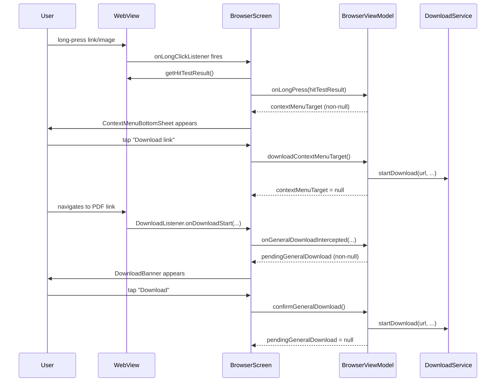

# Design Document: Context Menu and General Download

## Overview

This feature adds two complementary capabilities to the xdownload Android browser:

1. **Long-press context menu** — A `ModalBottomSheet` that appears when the user long-presses a link or image inside the WebView, offering context-sensitive actions (open in new tab, copy, download, share). Mirrors the Chrome long-press experience.

2. **General file download banner** — A dismissible in-app banner shown at the top of the browser screen when the WebView's `DownloadListener` intercepts a non-video file (PDF, ZIP, APK, image, etc.). Completely isolated from the existing video detection / FAB / quality-sheet flow.

### Key Design Decisions

- Context menu "Download link" / "Download image" call `DownloadService.startDownload` directly — no `DownloadBanner` confirm step.
- `DownloadBanner` auto-dismisses after 30 seconds of inactivity via a `viewModelScope` coroutine job.
- `VideoDetector` and the existing FAB/quality sheet are **not touched**.
- `DownloadService` is reused as-is; it already handles arbitrary MIME types.
- All new state lives in `BrowserViewModel`; all new UI lives in `BrowserScreen`.

---

## Architecture

The feature follows the existing MVVM + Hilt pattern used throughout the app.

```
BrowserScreen (Compose)
  │
  ├── WebView long-click listener
  │     └── calls viewModel.onLongPress(hitTestResult)
  │
  ├── WebView DownloadListener.onDownloadStart
  │     └── calls viewModel.onGeneralDownloadIntercepted(url, contentDisposition, mimeType, contentLength)
  │
  ├── ContextMenuBottomSheet (new composable)
  │     └── reads viewModel.contextMenuTarget
  │
  └── DownloadBanner (new composable)
        └── reads viewModel.pendingGeneralDownload

BrowserViewModel
  ├── contextMenuTarget: StateFlow<ContextMenuTarget?>
  ├── pendingGeneralDownload: StateFlow<PendingGeneralDownload?>
  ├── onLongPress(result: WebView.HitTestResult)
  ├── onGeneralDownloadIntercepted(url, contentDisposition, mimeType, contentLength)
  ├── confirmGeneralDownload()
  └── dismissGeneralDownload()
```



---

## Components and Interfaces

### New Data Models

```kotlin
// Sealed class representing what was long-pressed
sealed class ContextMenuTarget {
    data class Link(val url: String) : ContextMenuTarget()
    data class Image(val imageUrl: String) : ContextMenuTarget()
    data class LinkAndImage(val linkUrl: String, val imageUrl: String) : ContextMenuTarget()
    data class Video(val videoUrl: String) : ContextMenuTarget()
}

// State held while the DownloadBanner is visible
data class PendingGeneralDownload(
    val url: String,
    val fileName: String,       // inferred from Content-Disposition or URL path
    val mimeType: String,
    val fileSize: Long?,        // null if unknown
    val sourceUrl: String = ""
)
```

These are added to `Models.kt` alongside the existing `DetectedMedia`, `BrowserTab`, etc.

### BrowserViewModel additions

```kotlin
// Context menu state
private val _contextMenuTarget = MutableStateFlow<ContextMenuTarget?>(null)
val contextMenuTarget: StateFlow<ContextMenuTarget?> = _contextMenuTarget.asStateFlow()

// General download banner state
private val _pendingGeneralDownload = MutableStateFlow<PendingGeneralDownload?>(null)
val pendingGeneralDownload: StateFlow<PendingGeneralDownload?> = _pendingGeneralDownload.asStateFlow()

private var bannerAutoDismissJob: Job? = null

fun onLongPress(result: WebView.HitTestResult) { ... }
fun dismissContextMenu() { _contextMenuTarget.value = null }
fun downloadContextMenuTarget() { ... }   // calls DownloadService, then dismisses
fun openContextMenuTargetInNewTab() { ... }

fun onGeneralDownloadIntercepted(
    url: String,
    contentDisposition: String?,
    mimeType: String,
    contentLength: Long
) { ... }

fun confirmGeneralDownload() { ... }
fun dismissGeneralDownload() { ... }

// Pure helpers (internal, but exposed for testing)
internal fun inferFileName(url: String, contentDisposition: String?): String
internal fun ensureExtension(fileName: String, mimeType: String): String
internal fun mimeTypeToLabel(mimeType: String): String
```

`onPageStarted` is extended to also call `dismissContextMenu()` so the menu auto-closes on navigation.

### BrowserScreen additions

Two new composables are added to `BrowserScreen.kt`:

**`ContextMenuBottomSheet`** — `ModalBottomSheet` driven by `contextMenuTarget`. Renders link actions, image actions, video actions, or both link+image groups separated by a `HorizontalDivider`. Thumbnail loaded with Coil's `AsyncImage` for image targets. For video targets, shows the video URL as a subtitle and three actions: "Download video", "Copy video URL", "Share video".

**`DownloadBanner`** — `AnimatedVisibility` wrapping a `Surface` strip positioned at the top of the content `Box`, below the URL bar. Contains file name, type label, size, a "Download" button, and a dismiss "✕" button. Supports horizontal swipe-to-dismiss via `SwipeToDismissBox`.

Both composables are placed inside the existing content `Box` in `BrowserScreen`, alongside the existing `FloatingDownloadButton`.

### WebView wiring

In `WebViewContent` (inside `BrowserScreen.kt`):

```kotlin
// Long-press context menu
webView.setOnLongClickListener {
    val result = webView.hitTestResult
    viewModel.onLongPress(result)
    true
}

// General download interception
webView.setDownloadListener { url, userAgent, contentDisposition, mimeType, contentLength ->
    viewModel.onGeneralDownloadIntercepted(url, contentDisposition, mimeType, contentLength)
}
```

`onLongPress` inspects `result.type` and `result.extra`:
- `VIDEO_TYPE`, or `SRC_ANCHOR_TYPE` where `extra` has a video file extension (`.mp4`, `.webm`, `.mkv`, etc.) → `ContextMenuTarget.Video(videoUrl)`
- `SRC_ANCHOR_TYPE` (non-video) → `ContextMenuTarget.Link(url)`
- `IMAGE_TYPE` → `ContextMenuTarget.Image(imageUrl)`
- `SRC_IMAGE_ANCHOR_TYPE` → `ContextMenuTarget.LinkAndImage(linkUrl, imageUrl)`
- `UNKNOWN_TYPE`, `EDIT_TEXT_TYPE`, or blank/null `extra` → `contextMenuTarget = null`

---

## Data Models

### `ContextMenuTarget`

| Variant | Fields | When used |
|---|---|---|
| `Link` | `url: String` | `HitTestResult.SRC_ANCHOR_TYPE` (non-video URL) |
| `Image` | `imageUrl: String` | `HitTestResult.IMAGE_TYPE` |
| `LinkAndImage` | `linkUrl`, `imageUrl` | `HitTestResult.SRC_IMAGE_ANCHOR_TYPE` |
| `Video` | `videoUrl: String` | `HitTestResult.SRC_ANCHOR_TYPE` or `VIDEO_TYPE` where extra data is a direct video URL |

### `PendingGeneralDownload`

| Field | Type | Source |
|---|---|---|
| `url` | `String` | `DownloadListener.url` |
| `fileName` | `String` | `Content-Disposition` header → URL path segment |
| `mimeType` | `String` | `DownloadListener.mimeType` |
| `fileSize` | `Long?` | `DownloadListener.contentLength` (−1 → null) |
| `sourceUrl` | `String` | `BrowserViewModel._currentUrl` at intercept time |

### File name inference logic

```
inferFileName(url, contentDisposition):
  1. Parse Content-Disposition "filename=" or "filename*=" parameter → use if non-blank
  2. Else: take last path segment of URL (before '?')
  3. Else: fallback "download_<timestamp>"

ensureExtension(fileName, mimeType):
  if fileName already has a known extension → return as-is
  else → append extension from MIME_TO_EXTENSION map
```

### MIME type mappings

| MIME type | Extension | Label |
|---|---|---|
| `application/pdf` | `.pdf` | "PDF Document" |
| `application/zip` | `.zip` | "ZIP Archive" |
| `application/x-zip-compressed` | `.zip` | "ZIP Archive" |
| `application/vnd.android.package-archive` | `.apk` | "APK File" |
| `image/*` | `.jpg` / `.png` / etc. | "Image" |
| `text/*` | `.txt` | "Text File" |
| `application/octet-stream` | (from URL ext) | "File" |
| everything else | (from URL ext) | "File" |

---

## Correctness Properties

*A property is a characteristic or behavior that should hold true across all valid executions of a system — essentially, a formal statement about what the system should do. Properties serve as the bridge between human-readable specifications and machine-verifiable correctness guarantees.*

### Property 1: Link context menu contains all required actions

*For any* valid link URL, constructing a `ContextMenuTarget.Link` and deriving the action list SHALL produce a list containing exactly the four actions: "Open in new tab", "Copy link address", "Download link", and "Share link".

**Validates: Requirements 1.1**

---

### Property 2: Image context menu contains all required actions

*For any* valid image URL, constructing a `ContextMenuTarget.Image` and deriving the action list SHALL produce a list containing exactly the four actions: "Open image in new tab", "Copy image URL", "Download image", and "Share image".

**Validates: Requirements 2.1**

---

### Property 3: Combined link+image context menu contains all eight actions

*For any* valid link URL and image URL pair, constructing a `ContextMenuTarget.LinkAndImage` and deriving the action list SHALL produce a list containing all eight actions (four link actions and four image actions).

**Validates: Requirements 2.7**

---

### Property 4: Non-link/non-image long-press never sets contextMenuTarget

*For any* `HitTestResult` whose type is not `SRC_ANCHOR_TYPE`, `IMAGE_TYPE`, or `SRC_IMAGE_ANCHOR_TYPE`, calling `onLongPress` SHALL leave `contextMenuTarget` as `null`.

**Validates: Requirements 3.1, 3.5**

---

### Property 5: Non-video MIME types always produce a pendingGeneralDownload

*For any* MIME type string that does NOT start with `"video/"` or `"audio/"`, calling `onGeneralDownloadIntercepted` SHALL result in `pendingGeneralDownload` being non-null with `url`, `fileName`, `mimeType` fields all populated.

**Validates: Requirements 4.1, 5.1**

---

### Property 6: Video/audio MIME types never set pendingGeneralDownload

*For any* MIME type string that starts with `"video/"` or `"audio/"`, calling `onGeneralDownloadIntercepted` SHALL leave `pendingGeneralDownload` as `null`.

**Validates: Requirements 5.1, 5.2**

---

### Property 7: File name inference always produces a non-blank name

*For any* combination of URL string and optional `Content-Disposition` header string, `inferFileName` SHALL return a non-blank string.

**Validates: Requirements 6.1**

---

### Property 8: Extension inference always produces a name with an extension

*For any* extension-less file name and any MIME type string, `ensureExtension` SHALL return a string that contains at least one `'.'` character (i.e., has an extension appended).

**Validates: Requirements 6.2**

---

### Property 9: MIME-to-label mapping always returns a non-empty string

*For any* valid MIME type string (including arbitrary unknown types), `mimeTypeToLabel` SHALL return a non-empty, non-blank string.

**Validates: Requirements 6.3, 6.4**

---

### Property 10: Second download replaces first in banner state

*For any* two distinct `PendingGeneralDownload` values A and B, if `onGeneralDownloadIntercepted` is called for A and then for B (without confirming or dismissing A), `pendingGeneralDownload` SHALL equal B.

**Validates: Requirements 4.7**

---

### Property 11: Video context menu contains all required actions

*For any* valid video URL, constructing a `ContextMenuTarget.Video` and deriving the action list SHALL produce a list containing exactly the three actions: "Download video", "Copy video URL", and "Share video".

**Validates: Requirement 4.1**

---

## Error Handling

| Scenario | Handling |
|---|---|
| `HitTestResult` returns empty/null URL | `onLongPress` sets `contextMenuTarget = null`; no menu shown |
| `DownloadListener` fires with `contentLength = -1` | `PendingGeneralDownload.fileSize = null`; banner shows "Unknown size" |
| `Content-Disposition` header is malformed | `inferFileName` falls back to URL path segment |
| URL has no path segment (e.g. bare domain) | `inferFileName` falls back to `"download_<timestamp>"` |
| `DownloadService.startDownload` called while Wi-Fi-only mode is active and device is on mobile data | `DownloadService` handles this internally (existing behavior); no change needed |
| User navigates away while banner is visible | `onPageStarted` calls `dismissGeneralDownload()`, cancelling the auto-dismiss job |
| Auto-dismiss timer fires while user is interacting | Timer job is cancelled by `confirmGeneralDownload()` or `dismissGeneralDownload()` before it can clear state |

---

## Testing Strategy

### Unit tests (example-based)

- `onLongPress` with `SRC_ANCHOR_TYPE` → `contextMenuTarget` is `ContextMenuTarget.Link`
- `onLongPress` with `IMAGE_TYPE` → `contextMenuTarget` is `ContextMenuTarget.Image`
- `onLongPress` with `SRC_IMAGE_ANCHOR_TYPE` → `contextMenuTarget` is `ContextMenuTarget.LinkAndImage`
- `onLongPress` with `VIDEO_TYPE` and non-blank extra → `contextMenuTarget` is `ContextMenuTarget.Video`
- `onLongPress` with `VIDEO_TYPE` and blank extra → `contextMenuTarget` is `null`
- `onLongPress` with `UNKNOWN_TYPE` → `contextMenuTarget` is `null`
- `onPageStarted` while context menu is open → `contextMenuTarget` becomes `null`
- `confirmGeneralDownload()` → `pendingGeneralDownload` becomes `null`
- `dismissGeneralDownload()` → `pendingGeneralDownload` becomes `null`
- `downloadContextMenuTarget()` for a link → `DownloadService.startDownload` called, `pendingGeneralDownload` stays `null`
- Auto-dismiss: after 30 s, `pendingGeneralDownload` becomes `null` (use `TestCoroutineScheduler`)
- `inferFileName` with `Content-Disposition: attachment; filename="report.pdf"` → `"report.pdf"`
- `inferFileName` with no header, URL `https://example.com/files/doc.pdf?token=abc` → `"doc.pdf"`
- `ensureExtension("report", "application/pdf")` → `"report.pdf"`
- `mimeTypeToLabel("application/pdf")` → `"PDF Document"`
- `mimeTypeToLabel("application/vnd.android.package-archive")` → `"APK File"`
- `mimeTypeToLabel("image/png")` → `"Image"`
- `mimeTypeToLabel("application/octet-stream")` → `"File"`

### Property-based tests

Library: **[Kotest Property Testing](https://kotest.io/docs/proptest/property-based-testing.html)** (`io.kotest:kotest-property`), minimum 100 iterations per property.

Each test is tagged with a comment referencing the design property:
```
// Feature: context-menu-and-general-download, Property N: <property text>
```

| Property | Generator | Assertion |
|---|---|---|
| P1: Link actions complete | `Arb.string()` for URL | action list contains all 4 link actions |
| P2: Image actions complete | `Arb.string()` for URL | action list contains all 4 image actions |
| P3: Combined actions complete | `Arb.pair(Arb.string(), Arb.string())` | action list contains all 8 actions |
| P4: Non-media long-press → null | `Arb.element(UNKNOWN_TYPE, EDIT_TEXT_TYPE, ...)` | `contextMenuTarget == null` |
| P5: Non-video MIME → pendingDownload set | `Arb.string().filter { !it.startsWith("video/") && !it.startsWith("audio/") }` | `pendingGeneralDownload != null` |
| P6: Video/audio MIME → pendingDownload null | `Arb.element("video/mp4", "video/webm", "audio/mpeg", ...)` + `Arb.string().map { "video/$it" }` | `pendingGeneralDownload == null` |
| P7: inferFileName non-blank | `Arb.string()` for URL + `Arb.orNull(Arb.string())` for header | result is not blank |
| P8: ensureExtension has extension | `Arb.string().filter { '.' !in it }` + `Arb.string()` for MIME | result contains `'.'` |
| P9: mimeTypeToLabel non-empty | `Arb.string()` for MIME type | result is not empty or blank |
| P10: Second download replaces first | `Arb.pair(Arb.bind(...), Arb.bind(...))` for two distinct downloads | `pendingGeneralDownload == second` |
| P11: Video actions complete | `Arb.string()` for video URL | action list contains exactly 3 video actions |

### Integration / regression tests

- Verify `FloatingDownloadButton` remains visible when `pendingGeneralDownload` is non-null (co-existence of FAB and banner).
- Verify `VideoDetector.detectedMedia` is unaffected when `onGeneralDownloadIntercepted` is called with a non-video MIME type.
- Verify `DownloadService` creates a `DownloadEntity` in the Room database for a general (non-video) MIME type (reuses existing `DownloadService` integration test infrastructure).
