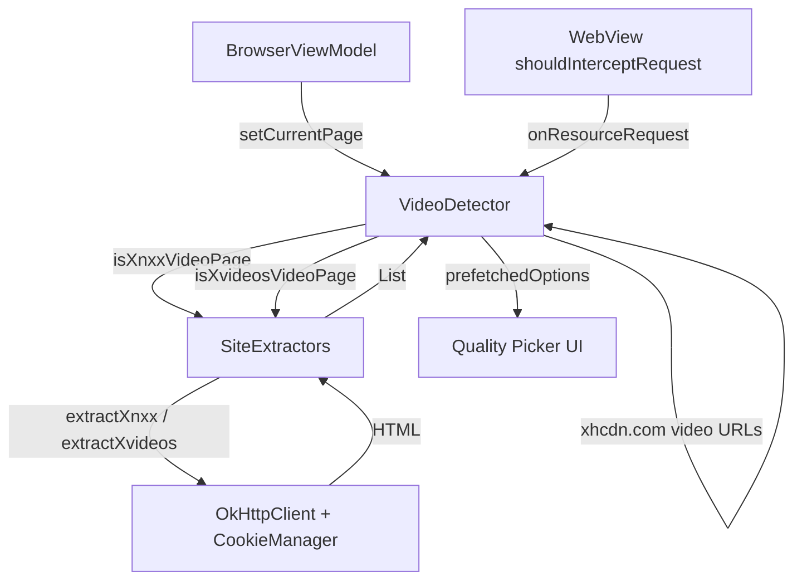

# Design Document: Site-Specific Extractors

## Overview

This feature adds gold-standard video extraction for XNXX, XVideos, and XHamster, matching the reliability of the existing Pornhub implementation. The approach is hybrid:

- **XNXX & XVideos**: Proactive page-fetch via OkHttp on `Dispatchers.IO` the moment the user navigates to a video page. The HTML is regex-scanned for `setVideoUrlHigh/Low/HLS` JS calls. Results are cached before the user taps download.
- **XHamster**: WebView interception. XHamster's own JS deciphers obfuscated CDN URLs and makes requests that pass through `shouldInterceptRequest`. The interception path is improved to ensure `xhcdn.com` video URLs are not filtered and are correctly quality-labelled.

The PH implementation is **completely untouched** — the only PH-related change is adding a suppression guard in `onResourceRequest` that was already implied by the existing architecture.

---

## Architecture



**Key invariants:**
- `VideoDetector` is the single source of truth for `_detectedMedia` and `_hasMedia`.
- All network I/O runs on `Dispatchers.IO`.
- `activeExtractionJob` is cancelled on every `setCurrentPage` and `clearDetectedMedia` call, preventing stale results.
- The generic detection path for non-gold-standard sites is **unchanged**.

---

## Components and Interfaces

### New file: `SiteExtractors.kt`

```kotlin
class SiteExtractors(
    private val okHttpClient: OkHttpClient,
    private val cookieProvider: (String) -> String?
) {
    suspend fun extractXnxx(pageUrl: String): List<MediaQualityOption>
    suspend fun extractXvideos(pageUrl: String): List<MediaQualityOption>
}
```

- Constructor takes `OkHttpClient` and a `cookieProvider: (String) -> String?` lambda (backed by `CookieManager.getInstance().getCookie`).
- Both `extract*` functions are `suspend` and must be called from a coroutine on `Dispatchers.IO`.
- No XHamster logic lives here.

### Changes to `VideoDetector.kt`

**New fields:**
```kotlin
private val siteExtractors = SiteExtractors(okHttpClient) { url ->
    android.webkit.CookieManager.getInstance().getCookie(url)
        ?: android.webkit.CookieManager.getInstance().getCookie(currentPageUrl)
}
private var activeExtractionJob: Job? = null
```

**New site-detection helpers** (using yt-dlp's exact regex patterns):
```kotlin
private fun isXnxxPage(): Boolean =
    Regex("""(?:video|www)\.xnxx3?\.com""").containsMatchIn(currentPageUrl.lowercase())

private fun isXvideosPage(): Boolean =
    Regex("""(?:[^.]+\.)?xvideos2?\.com""").containsMatchIn(currentPageUrl.lowercase()) ||
    Regex("""(?:www\.)?xvideos\.es""").containsMatchIn(currentPageUrl.lowercase())

private fun isXhamsterPage(): Boolean =
    Regex("""(?:[^.]+\.)?(?:xhamster\.(?:com|one|desi)|xhms\.pro|xhamster\d+\.(?:com|desi)|xhday\.com|xhvid\.com)""")
        .containsMatchIn(currentPageUrl.lowercase())

private fun isXnxxVideoPage(): Boolean =
    isXnxxPage() && currentPageUrl.contains("/video-", ignoreCase = true)

private fun isXvideosVideoPage(): Boolean =
    isXvideosPage() && currentPageUrl.contains("/video", ignoreCase = true)
```

**Modified `setCurrentPage()`:**
```kotlin
fun setCurrentPage(url: String, title: String) {
    currentPageUrl = url
    currentPageTitle = title
    activeExtractionJob?.cancel()
    activeExtractionJob = null

    val triggeredForUrl = url

    when {
        isXnxxVideoPage() -> {
            activeExtractionJob = scope.launch {
                val options = siteExtractors.extractXnxx(triggeredForUrl)
                if (currentPageUrl != triggeredForUrl) return@launch
                registerSiteExtractorResult(triggeredForUrl, options)
            }
        }
        isXvideosVideoPage() -> {
            activeExtractionJob = scope.launch {
                val options = siteExtractors.extractXvideos(triggeredForUrl)
                if (currentPageUrl != triggeredForUrl) return@launch
                registerSiteExtractorResult(triggeredForUrl, options)
            }
        }
    }
}
```

**Modified `clearDetectedMedia()`** — adds `activeExtractionJob?.cancel()`.

**Modified `onResourceRequest()`** — gold-standard suppression block inserted after the `get_media` check:
```kotlin
// Gold-standard suppression
if (isPornhubPage()) return false          // get_media handles PH
if (isXnxxPage() || isXvideosPage()) return false  // page-fetch handles these
if (isXhamsterPage()) {
    if (!lowUrl.contains("xhcdn.com")) return false
    val isVideoFile = VIDEO_EXTENSIONS.any { lowUrl.substringBefore("?").endsWith(it) } ||
        STREAM_EXTENSIONS.any { lowUrl.substringBefore("?").endsWith(it) } ||
        (mimeType != null && (mimeType.startsWith("video/") || mimeType.startsWith("application/x-mpegurl")))
    if (!isVideoFile) return false
    // fall through to standard detection for xhcdn.com video URLs
}
```

**Modified `fetchQualityOptions()`** — checks `prefetchedOptions` by `sourcePageUrl` first:
```kotlin
// Check prefetchedOptions by sourcePageUrl for site-specific results
prefetchedOptions[media.sourcePageUrl]?.let { cached ->
    if (cached.isNotEmpty()) return@withContext cached
}
// Also check by media.url (existing PH path)
prefetchedOptions[media.url]?.let { cached ->
    if (cached.isNotEmpty()) return@withContext cached
}
```

---

## Data Models

No new data models are introduced. The feature reuses existing types:

| Type | Role |
|---|---|
| `MediaQualityOption` | One downloadable URL with quality label, MIME type, file size |
| `DetectedMedia` | One detected video entry in `_detectedMedia`; for site-specific results, `url == sourcePageUrl == triggeredForUrl` |

### Result registration (private helper `registerSiteExtractorResult`)

```kotlin
private fun registerSiteExtractorResult(triggeredForUrl: String, options: List<MediaQualityOption>) {
    if (options.isEmpty()) return
    prefetchedOptions[triggeredForUrl] = options

    if (triggeredForUrl !in detectedUrls) {
        detectedUrls.add(triggeredForUrl)
        val media = DetectedMedia(
            url = triggeredForUrl,
            title = currentPageTitle.ifEmpty { "Video" },
            mimeType = "video/mp4",
            quality = options.first().quality,
            sourcePageUrl = triggeredForUrl,
            sourcePageTitle = currentPageTitle,
            thumbnailUrl = currentPageThumbnail,
            detectionIndex = detectionCounter.getAndIncrement()
        )
        val currentList = _detectedMedia.value.toMutableList()
        currentList.add(media)
        _detectedMedia.value = currentList
        _hasMedia.value = true
    }

    // Pre-fetch file sizes concurrently
    scope.launch {
        val sizeJobs = options.map { opt ->
            async {
                val size = withTimeoutOrNull(5000L) { getFileSizeSmart(opt.url) }
                opt.copy(fileSize = size)
            }
        }
        val withSizes = sizeJobs.awaitAll()
        prefetchedOptions[triggeredForUrl] = withSizes
    }
}
```

---

## Extraction Logic

### XNXX (port of yt-dlp `xnxx.py`)

```kotlin
suspend fun extractXnxx(pageUrl: String): List<MediaQualityOption> = withContext(Dispatchers.IO) {
    val html = fetchPage(pageUrl) ?: return@withContext emptyList()
    val options = mutableListOf<MediaQualityOption>()
    val seen = mutableSetOf<String>()
    val regex = Regex("""setVideo(?:Url(?:Low|High)|HLS)\s*\(\s*["'](?<url>(?:https?:)?//.+?)["']""")
    for (match in regex.findAll(html)) {
        val url = match.groups["url"]?.value ?: continue
        if (!seen.add(url)) continue
        val kind = match.value.substringAfter("setVideo").substringBefore("(").trim().lowercase()
        val quality = when {
            kind.startsWith("urlhigh") -> "High"
            kind.startsWith("urllow")  -> "Low"
            kind == "hls"              -> "HLS"
            else                       -> "Default"
        }
        val mimeType = if (kind == "hls") "application/x-mpegurl" else "video/mp4"
        options.add(MediaQualityOption(url = url, quality = quality, mimeType = mimeType))
    }
    options
}
```

### XVideos (port of yt-dlp `xvideos.py`)

```kotlin
suspend fun extractXvideos(pageUrl: String): List<MediaQualityOption> = withContext(Dispatchers.IO) {
    val html = fetchPage(pageUrl) ?: return@withContext emptyList()
    val options = mutableListOf<MediaQualityOption>()
    val seen = mutableSetOf<String>()

    // Primary: setVideo*(...) pattern
    val regex = Regex("""setVideo([^(]+)\(["'](https?://.+?)["']\)""")
    for (match in regex.findAll(html)) {
        val kind = match.groupValues[1].trim().lowercase()
        val url  = match.groupValues[2]
        if (!seen.add(url)) continue
        val quality  = when (kind) {
            "urlhigh" -> "High"
            "urllow"  -> "Low"
            "hls"     -> "HLS"
            else      -> kind.ifEmpty { "Default" }
        }
        val mimeType = if (kind == "hls") "application/x-mpegurl" else "video/mp4"
        options.add(MediaQualityOption(url = url, quality = quality, mimeType = mimeType))
    }

    // Fallback: flv_url= in page source
    val flvMatch = Regex("""flv_url=([^&"'\s]+)""").find(html)
    if (flvMatch != null) {
        val flvUrl = java.net.URLDecoder.decode(flvMatch.groupValues[1], "UTF-8")
        if (flvUrl.startsWith("http") && seen.add(flvUrl)) {
            options.add(MediaQualityOption(url = flvUrl, quality = "FLV", mimeType = "video/x-flv"))
        }
    }
    options
}
```

### Page-fetch helper (shared)

```kotlin
private suspend fun fetchPage(pageUrl: String): String? {
    return try {
        val cookie = cookieProvider(pageUrl)
        val request = Request.Builder()
            .url(pageUrl)
            .apply { if (!cookie.isNullOrEmpty()) addHeader("Cookie", cookie) }
            .addHeader("User-Agent", DESKTOP_USER_AGENT)
            .addHeader("Referer", pageUrl)
            .addHeader("Accept-Language", "en-US,en;q=0.9")
            .build()
        val response = okHttpClient.newCall(request).execute()
        if (!response.isSuccessful) {
            Log.e(TAG, "Page fetch failed: HTTP ${response.code} for $pageUrl")
            return null
        }
        response.body?.string()
    } catch (e: Exception) {
        Log.e(TAG, "Page fetch exception for $pageUrl", e)
        null
    }
}

companion object {
    private const val DESKTOP_USER_AGENT =
        "Mozilla/5.0 (Windows NT 10.0; Win64; x64) AppleWebKit/537.36 (KHTML, like Gecko) Chrome/120.0.0.0 Safari/537.36"
}
```

---

## Correctness Properties

*A property is a characteristic or behavior that should hold true across all valid executions of a system — essentially, a formal statement about what the system should do. Properties serve as the bridge between human-readable specifications and machine-verifiable correctness guarantees.*

### Property 1: Suppression completeness

*For any* URL intercepted via `onResourceRequest` while `currentPageUrl` is a gold-standard site page (PH, XNXX, XVideos, or XHamster), if that URL is not a `get_media` URL (PH) or a `xhcdn.com` video file URL (XHamster), then `_detectedMedia` SHALL NOT grow and `onResourceRequest` SHALL return `false`.

**Validates: Requirements 1.4, 1.5, 6.1, 6.2, 6.3, 6.4, 6.8**

---

### Property 2: No stale results after clear

*For any* in-flight page-fetch coroutine, if `clearDetectedMedia()` is called before the coroutine completes, then when the coroutine does complete it SHALL NOT add any entries to `_detectedMedia`.

**Validates: Requirements 2.5, 6.10**

---

### Property 3: Idempotent extraction

*For any* XNXX or XVideos video page URL, calling `setCurrentPage` with that URL two or more times (without an intervening `clearDetectedMedia`) SHALL result in at most one `DetectedMedia` entry in `_detectedMedia` for that URL.

**Validates: Requirements 2.6, 8.4**

---

### Property 4: Regex coverage for site detection

*For any* URL from yt-dlp's canonical test cases for XNXX, XVideos, or XHamster, the corresponding `isXnxxPage()`, `isXvideosPage()`, or `isXhamsterPage()` function SHALL return `true`. Conversely, for any URL that is not from those sites, all three functions SHALL return `false`.

**Validates: Requirements 2.7**

---

### Property 5: Generic detection unchanged

*For any* URL intercepted via `onResourceRequest` while `currentPageUrl` is a non-gold-standard page, the return value and `_detectedMedia` mutation SHALL be identical to the pre-feature behavior of `onResourceRequest`.

**Validates: Requirements 6.5**

---

### Property 6: XNXX regex extraction completeness

*For any* HTML string containing one or more occurrences of `setVideoUrlHigh(...)`, `setVideoUrlLow(...)`, or `setVideoHLS(...)`, `XnxxExtractor.extractXnxx` SHALL return a `MediaQualityOption` for every distinct URL found, with the correct quality label (`"High"`, `"Low"`, or `"HLS"`) and no duplicate URLs in the result.

**Validates: Requirements 3.2, 3.3, 3.4, 3.5, 3.8**

---

### Property 7: XVideos regex extraction completeness

*For any* HTML string containing one or more occurrences of `setVideoUrlHigh(...)`, `setVideoUrlLow(...)`, `setVideoHLS(...)`, or a `flv_url=` parameter, `XvideosExtractor.extractXvideos` SHALL return a `MediaQualityOption` for every distinct URL found, with the correct quality label and no duplicate URLs in the result.

**Validates: Requirements 4.2, 4.3, 4.4, 4.5, 4.6, 4.9**

---

### Property 8: prefetchedOptions round-trip

*For any* list of `MediaQualityOption` objects stored in `prefetchedOptions` under a page URL key, a subsequent call to `fetchQualityOptions` for a `DetectedMedia` whose `sourcePageUrl` equals that key SHALL return those options without making additional network requests.

**Validates: Requirements 7.2, 7.3**

---

## Error Handling

| Scenario | Behaviour |
|---|---|
| Page fetch returns non-2xx | Log error, return empty list; no `DetectedMedia` added; generic detection still suppressed |
| Page fetch throws exception | Same as above |
| No `setVideo*` matches in HTML | Return empty list; no `DetectedMedia` added |
| `flv_url` decode fails | Skip FLV option; other options still returned |
| File size fetch times out (>5000ms) | Option included with `fileSize = null` |
| Coroutine completes after `clearDetectedMedia` | `currentPageUrl != triggeredForUrl` guard discards results |
| `activeExtractionJob` cancelled mid-flight | Coroutine exits cleanly; no partial state written |
| Gold-standard extractor fails silently | Suppression still active; user sees zero detections; failure logged |

---

## Testing Strategy

### Unit tests (example-based)

- `XnxxExtractor` with mock HTML containing each quality variant (`High`, `Low`, `HLS`)
- `XvideosExtractor` with mock HTML including `flv_url` fallback
- `XnxxExtractor` / `XvideosExtractor` with non-2xx mock response → empty list, no crash
- `XnxxExtractor` / `XvideosExtractor` with HTML containing no `setVideo*` → empty list
- `VideoDetector.fetchQualityOptions` returns cached options when `prefetchedOptions` is populated
- `VideoDetector.clearDetectedMedia` clears `prefetchedOptions` and cancels `activeExtractionJob`
- HTTP headers (`Cookie`, `User-Agent`, `Referer`, `Accept-Language`) present in page-fetch request

### Property-based tests (using [kotest-property](https://kotest.io/docs/proptest/property-based-testing.html), minimum 100 iterations each)

Each property test is tagged with a comment referencing the design property it validates.

**Feature: site-specific-extractors, Property 1: Suppression completeness**
- Generator: random URL strings × gold-standard `currentPageUrl` values
- Assertion: `onResourceRequest` returns `false` and `_detectedMedia` does not grow (except for `get_media` / `xhcdn.com` video cases)

**Feature: site-specific-extractors, Property 2: No stale results after clear**
- Generator: random XNXX/XVideos page URLs with simulated in-flight coroutines
- Assertion: after `clearDetectedMedia()`, `_detectedMedia` remains empty regardless of coroutine completion

**Feature: site-specific-extractors, Property 3: Idempotent extraction**
- Generator: random XNXX/XVideos video page URLs
- Assertion: calling `setCurrentPage` twice with the same URL produces ≤1 `DetectedMedia` entry

**Feature: site-specific-extractors, Property 4: Regex coverage**
- Generator: URL strings from yt-dlp test cases for XNXX, XVideos, XHamster
- Assertion: `isXnxxPage()` / `isXvideosPage()` / `isXhamsterPage()` return correct boolean for each

**Feature: site-specific-extractors, Property 5: Generic detection unchanged**
- Generator: random non-gold-standard URLs × random MIME types
- Assertion: `onResourceRequest` return value and `_detectedMedia` delta match a reference implementation of the pre-feature logic

**Feature: site-specific-extractors, Property 6: XNXX regex extraction completeness**
- Generator: HTML strings with random combinations of `setVideoUrlHigh`, `setVideoUrlLow`, `setVideoHLS` calls (including duplicates)
- Assertion: result contains exactly the set of distinct URLs, each with correct quality label

**Feature: site-specific-extractors, Property 7: XVideos regex extraction completeness**
- Generator: HTML strings with random combinations of `setVideo*` calls and optional `flv_url=` parameter
- Assertion: result contains exactly the set of distinct URLs, each with correct quality label

**Feature: site-specific-extractors, Property 8: prefetchedOptions round-trip**
- Generator: random lists of `MediaQualityOption` objects × random page URL strings
- Assertion: `fetchQualityOptions` returns the stored options without network calls
