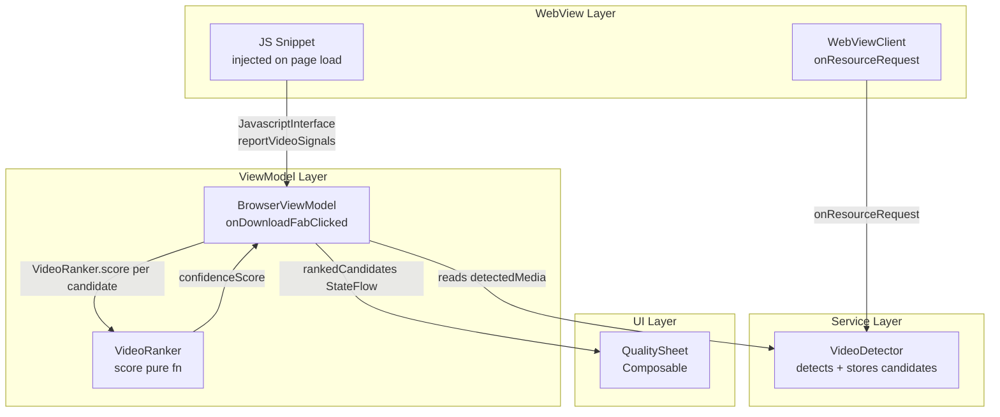

# Design Document: Smart Video Ranking

## Overview

The smart-video-ranking feature replaces the ad-hoc `scoreMediaCandidate()` function in `BrowserViewModel` with a dedicated, pure `VideoRanker` component. The ranker combines multiple weak signals — URL type, temporal detection order, file size, playback state, ad URL patterns, and ad UI patterns — into a single `confidenceScore` per candidate. The ranked list is then surfaced in an updated Quality Sheet that prominently shows the top candidate while giving the user access to every detected candidate.

The guiding principle is **ranking ≠ filtering**: no candidate is ever removed from the list. Every signal contributes a positive or negative score adjustment; the lowest-scoring candidate still appears in the UI.

### Key Design Decisions

- **Pure function ranker**: `VideoRanker.score()` is a pure function of its inputs. No I/O, no coroutines, no Android dependencies. This makes it trivially testable and safe to call from any thread. Scoring is pure CPU math (microseconds), so it adds zero perceptible latency to the FAB click.
- **Ranking happens continuously in the background, not at click time**: The ViewModel maintains a `rankedCandidates` derived state that is recomputed whenever `detectedMedia` changes — the same way the existing prefetch already picks the best candidate in `init {}`. By the time the user taps the FAB, the top candidate is already known. The FAB click only opens the sheet; it does not trigger ranking.
- **Extend `DetectedMedia` rather than create a parallel model**: New fields (`detectionIndex`, `isPlaying`, `isVisible`, `hasAdUIPatterns`) are added to `DetectedMedia` with nullable/default values so existing code paths continue to work without modification.
- **JavaScript injection for DOM signals**: Ad UI patterns and playback state are collected via a small JS snippet injected by the WebView's `WebViewClient`. Results are posted back to the ViewModel via a `JavascriptInterface`.
- **`BrowserViewModel` owns ranking**: The ViewModel calls `VideoRanker.score()` and sorts candidates. The ranker itself has no knowledge of Android lifecycle or coroutines.
- **Quality sheet shows only the top video by default**: The sheet opens immediately showing the main (top-ranked) video with its thumbnail, title, and quality options. Other detected candidates are hidden behind a collapsed "Other Videos" row at the bottom — the user never sees them unless they explicitly tap to expand.

---

## Architecture



The data flow is:
1. `WebViewClient.shouldInterceptRequest` → `VideoDetector.onResourceRequest` → candidate added with `detectionIndex`
2. JS snippet fires on `onPageFinished` → `JavascriptInterface.reportVideoSignals(json)` → `BrowserViewModel` updates `isPlaying`, `isVisible`, `hasAdUIPatterns` on matching candidates
3. `BrowserViewModel` continuously maintains `rankedCandidates` as a derived state — recomputed in the background whenever `detectedMedia` changes. No ranking happens at click time.
4. On FAB click → sheet opens immediately with `topCandidate` already known; quality options fetch proceeds as before
5. `QualitySheet` reads `topCandidate` for the primary card and `otherCandidates` for the collapsed "Other Videos" section

---

## Components and Interfaces

### `VideoRanker` (new — `service/VideoRanker.kt`)

A stateless object (or `@Singleton` with no mutable state) that exposes a single pure function:

```kotlin
object VideoRanker {

    data class ScoreBreakdown(
        val typeScore: Int,
        val temporalBonus: Int,
        val fileSizeBonus: Int,
        val playbackBonus: Int,
        val adUrlPenalty: Int,
        val adUiPenalty: Int,
        val tinyFilePenalty: Int,
        val total: Int
    )

    /** Pure scoring function — no I/O, no side effects. */
    fun score(candidate: DetectedMedia, prefetchedFileSize: Long? = null): ScoreBreakdown

    /** Rank a list of candidates, highest score first. Ties broken by detectionIndex descending. */
    fun rank(candidates: List<DetectedMedia>, fileSizes: Map<String, Long> = emptyMap()): List<DetectedMedia>

    // Internal constants (visible for testing)
    val AD_URL_PATTERNS: List<String>
    const val AD_URL_PENALTY: Int
    const val AD_UI_PENALTY: Int
    const val TINY_FILE_THRESHOLD: Long   // 500_000 bytes
    const val TINY_FILE_PENALTY: Int
    const val PLAYING_BONUS: Int
    const val VISIBLE_BONUS: Int
    const val HIDDEN_PENALTY: Int
    const val TEMPORAL_BONUS_PER_INDEX: Int
    const val TEMPORAL_MAX_BONUS: Int
}
```

Score weights (tunable constants):

| Signal | Value |
|---|---|
| PH get_media URL type | +10 000 |
| Direct video extension (.mp4 etc.) | +5 000 |
| Stream manifest (.m3u8 / .mpd) | +3 000 |
| Thumbnail present | +200 |
| Title present | +50 |
| Temporal bonus | +100 × detectionIndex (capped at +2 000) |
| File size bonus | +1 per 100 KB, capped at +3 000 |
| Playing bonus | +4 000 |
| Visible bonus | +1 000 |
| Hidden penalty | −500 |
| Ad URL penalty | −8 000 |
| Ad UI penalty | −3 000 |
| Tiny file penalty (< 500 KB) | −8 000 |

The temporal cap (+2 000) ensures a PH get_media URL detected first (type score +10 000) still outranks a generic MP4 detected last (type +5 000 + temporal max +2 000 = +7 000).

### `DetectedMedia` (extended — `data/model/Models.kt`)

```kotlin
data class DetectedMedia(
    val url: String,
    val title: String? = null,
    val mimeType: String? = null,
    val quality: String? = null,
    val fileSize: Long? = null,
    val sourcePageUrl: String = "",
    val sourcePageTitle: String = "",
    val thumbnailUrl: String? = null,
    // --- new fields ---
    val detectionIndex: Int = 0,          // 0-based, set by VideoDetector
    val isPlaying: Boolean? = null,       // null = unknown
    val isVisible: Boolean? = null,       // null = unknown
    val hasAdUIPatterns: Boolean? = null  // null = unknown
)
```

All new fields are nullable/defaulted so existing call sites compile without changes.

### `VideoDetector` (modified — `service/VideoDetector.kt`)

- Add `private var detectionCounter: AtomicInteger = AtomicInteger(0)`
- In `onResourceRequest`, stamp each new `DetectedMedia` with `detectionIndex = detectionCounter.getAndIncrement()`
- In `clearDetectedMedia()`, reset `detectionCounter` to 0
- Add `fun updateCandidateSignals(url: String, isPlaying: Boolean?, isVisible: Boolean?, hasAdUIPatterns: Boolean?)` — called by `BrowserViewModel` after JS results arrive; replaces the matching candidate in `_detectedMedia` with an updated copy

### `VideoSignalsJsInterface` (new — `ui/browser/VideoSignalsJsInterface.kt`)

A `@JavascriptInterface` class injected into the WebView. The JS snippet calls `Android.reportVideoSignals(jsonArray)` where each element is:

```json
{ "url": "...", "isPlaying": true, "isVisible": true, "hasAdUI": false }
```

The interface parses the JSON and calls `viewModel.onVideoSignalsReceived(signals)`.

### `BrowserViewModel` (modified)

- Remove the existing `scoreMediaCandidate()` private function
- Add `val rankedCandidates: StateFlow<List<DetectedMedia>>` — derived from `detectedMedia` + `prefetchedFileSizes`, recomputed in the background whenever either changes (not at click time)
- Add `val topCandidate: StateFlow<DetectedMedia?>` — `rankedCandidates.firstOrNull()`
- Add `val otherCandidates: StateFlow<List<DetectedMedia>>` — `rankedCandidates.drop(1)`
- Replace the `init {}` prefetch's `scoreMediaCandidate()` call with `rankedCandidates.firstOrNull()` — no duplicate scoring logic
- Add `fun onVideoSignalsReceived(signals: List<VideoSignal>)` — calls `videoDetector.updateCandidateSignals()` for each signal
- Update `onDownloadFabClicked()` to use `topCandidate` directly (already ranked) instead of sorting inline
- Emit `Log.d` score breakdown per candidate (Requirement 9)

### `QualitySheet` (modified — `ui/browser/BrowserScreen.kt`)

The sheet layout when the user taps the FAB:

1. **Top section — main video (always visible, no interaction needed)**
   - Thumbnail (from `topCandidate.thumbnailUrl`, same as today)
   - Title
   - Quality options list, expanded and ready to tap

2. **Bottom row — "Other Videos" (collapsed by default, only shown when `otherCandidates` is non-empty)**
   - A single tappable row labelled "Other Videos (N)" that expands/collapses the list below it
   - When expanded, shows each other candidate as a title-only row
   - Tapping a candidate row expands its quality options inline (accordion: only one open at a time — tapping a second candidate collapses the first)
   - No thumbnails in the "Other Videos" list — title text only
   - When only one candidate exists, this row is hidden entirely

---

## Data Models

### `VideoSignal` (new — `ui/browser/VideoSignalsJsInterface.kt`)

```kotlin
data class VideoSignal(
    val url: String,
    val isPlaying: Boolean?,
    val isVisible: Boolean?,
    val hasAdUIPatterns: Boolean?
)
```

### `RankedCandidate` (optional wrapper — not strictly needed)

The ViewModel exposes `List<DetectedMedia>` directly (with scores embedded via `ScoreBreakdown` if needed for UI badges). To avoid polluting `DetectedMedia` with UI concerns, the ViewModel can expose a thin wrapper:

```kotlin
data class RankedCandidate(
    val media: DetectedMedia,
    val scoreBreakdown: VideoRanker.ScoreBreakdown
)
```

This lets the Quality Sheet display "why did this rank low?" badges without adding UI fields to the domain model.

---

## JavaScript Snippet

Injected via `webView.evaluateJavascript()` on `onPageFinished`:

```javascript
(function() {
  var videos = document.querySelectorAll('video');
  var results = [];
  videos.forEach(function(v) {
    var src = v.currentSrc || v.src;
    if (!src) return;
    var rect = v.getBoundingClientRect();
    var isVisible = rect.width > 0 && rect.height > 0
                    && rect.top < window.innerHeight && rect.bottom > 0
                    && getComputedStyle(v).display !== 'none'
                    && getComputedStyle(v).visibility !== 'hidden';
    var isPlaying = !v.paused && !v.ended && v.readyState > 2;
    // Ad UI detection: scan parent up to 3 levels
    var hasAdUI = false;
    var node = v.parentElement;
    for (var i = 0; i < 3 && node; i++) {
      var text = (node.innerText || '').toLowerCase();
      if (/skip|advertisement|sponsored|\bad\b|ad ends in/.test(text)) {
        hasAdUI = true; break;
      }
      node = node.parentElement;
    }
    results.push({url: src, isPlaying: isPlaying, isVisible: isVisible, hasAdUI: hasAdUI});
  });
  Android.reportVideoSignals(JSON.stringify(results));
})();
```

---

## Correctness Properties

*A property is a characteristic or behavior that should hold true across all valid executions of a system — essentially, a formal statement about what the system should do. Properties serve as the bridge between human-readable specifications and machine-verifiable correctness guarantees.*

### Property 1: Temporal Ordering

*For any* two candidates that are identical in all attributes except `detectionIndex`, the candidate with the higher `detectionIndex` SHALL receive a strictly higher confidence score.

**Validates: Requirements 1.2**

---

### Property 2: Ad URL Penalty

*For any* candidate URL, inserting a known ad-network pattern substring into the URL SHALL decrease the candidate's confidence score.

**Validates: Requirements 2.2**

---

### Property 3: No-Filtering Invariant

*For any* non-empty list of candidates (regardless of URL patterns, file sizes, or detection order), the ranked output list SHALL contain exactly the same number of candidates as the input list.

**Validates: Requirements 2.3, 3.3, 4.3, 8.1, 8.2**

---

### Property 4: File Size Bonus

*For any* two candidates that are identical in all attributes except `fileSize`, the candidate with the larger known file size SHALL receive a higher or equal confidence score.

**Validates: Requirements 3.1, 3.4**

---

### Property 5: Ad UI Penalty

*For any* candidate, setting `hasAdUIPatterns = true` SHALL produce a strictly lower confidence score than `hasAdUIPatterns = false`, all other attributes being equal.

**Validates: Requirements 4.2**

---

### Property 6: Playback State Ordering

*For any* candidate, the confidence score ordering SHALL satisfy: `isPlaying=true` > `isPlaying=false, isVisible=true` > `isPlaying=false, isVisible=false`, all other attributes being equal.

**Validates: Requirements 5.2, 5.3, 5.4**

---

### Property 7: Determinism

*For any* set of candidate attributes, calling `VideoRanker.score()` twice with the same inputs SHALL return identical `ScoreBreakdown` values.

**Validates: Requirements 6.2, 6.4**

---

### Property 8: Tie-Breaking by Temporal Index

*For any* two candidates that produce equal total confidence scores, `VideoRanker.rank()` SHALL place the candidate with the higher `detectionIndex` first in the output list.

**Validates: Requirements 6.3**

---

### Property 9: Tiny-File Penalty

*For any* candidate with `fileSize < 500_000` bytes, the confidence score SHALL be strictly lower than the same candidate with `fileSize >= 500_000` bytes, all other attributes being equal.

**Validates: Requirements 8.4**

---

### Property 10: Ranked List is Sorted

*For any* non-empty list of candidates, the output of `VideoRanker.rank()` SHALL be sorted in descending order of confidence score (with ties broken by descending `detectionIndex`).

**Validates: Requirements 7.4**

---

### Property 11: URL Truncation in Logs

*For any* URL of arbitrary length, the URL substring included in a debug log entry SHALL be at most 100 characters long.

**Validates: Requirements 9.3**

---

## Error Handling

| Scenario | Handling |
|---|---|
| JS injection fails (DOM access denied) | `hasAdUIPatterns` and `isPlaying`/`isVisible` remain `null`; ranker treats null as "unknown" and applies no penalty |
| `reportVideoSignals` receives malformed JSON | `VideoSignalsJsInterface` catches `JSONException`, logs at debug level, no crash |
| `prefetchedFileSizes` has no entry for a candidate | `fileSize` treated as `null`; no size bonus, no tiny-file penalty |
| All candidates have ad patterns | All are penalized equally; the least-penalized one still surfaces as top candidate |
| `rankedCandidates` is empty when FAB is tapped | Existing "play a video first" message is shown (no change to this path) |
| Top-ranked candidate returns empty quality options | `BrowserViewModel` iterates `rankedCandidates` in order until a candidate with valid options is found (Requirement 8.6) |
| `detectionCounter` overflow | `AtomicInteger` wraps at `Int.MAX_VALUE`; in practice a page will never have 2 billion video requests |

---

## Testing Strategy

### Unit Tests (example-based)

- `VideoRankerTest`: concrete examples for each signal in isolation (PH get_media type score, ad URL penalty, tiny-file penalty, tie-breaking)
- `VideoDetectorTest`: verify `detectionIndex` increments correctly and resets on `clearDetectedMedia()`
- `VideoSignalsJsInterfaceTest`: verify JSON parsing for well-formed and malformed inputs
- `BrowserViewModelTest`: verify `topCandidate` is the highest-scored candidate after `onDownloadFabClicked()`; verify fallback to next candidate when top returns empty options

### Property-Based Tests

Property-based testing is performed using [Kotest's property testing module](https://kotest.io/docs/proptest/property-based-testing.html) (`io.kotest:kotest-property`), which provides generators and runs each property with a minimum of 100 iterations.

Each property test is tagged with a comment referencing the design property it validates:
`// Feature: smart-video-ranking, Property N: <property text>`

Properties to implement as PBT:

| Property | Generator Strategy |
|---|---|
| P1 Temporal ordering | Generate `DetectedMedia` with random attributes; create two copies differing only in `detectionIndex` |
| P2 Ad URL penalty | Generate random base URLs; randomly inject one of the known ad patterns |
| P3 No-filtering invariant | Generate lists of 1–20 candidates with arbitrary attributes including ad patterns and tiny sizes |
| P4 File size bonus | Generate candidates with random `fileSize` pairs where sizeA > sizeB |
| P5 Ad UI penalty | Generate candidates; toggle `hasAdUIPatterns` |
| P6 Playback state ordering | Generate candidates; vary `isPlaying`/`isVisible` combinations |
| P7 Determinism | Generate arbitrary candidate attributes; call `score()` twice |
| P8 Tie-breaking | Generate candidates with identical attributes except `detectionIndex`; force equal scores by using identical inputs |
| P9 Tiny-file penalty | Generate candidates with `fileSize` in `[0, 499_999]` vs `[500_000, Long.MAX_VALUE]` |
| P10 Ranked list sorted | Generate lists of 1–20 candidates; verify output is sorted |
| P11 URL truncation | Generate strings of arbitrary length (including > 100 chars) |

### Integration Tests

- End-to-end: load a mock page with a pre-roll ad URL and a main content URL; verify `topCandidate` is the main content URL after ranking
- JS injection: verify `reportVideoSignals` is called with correct data on a real WebView in an instrumented test
